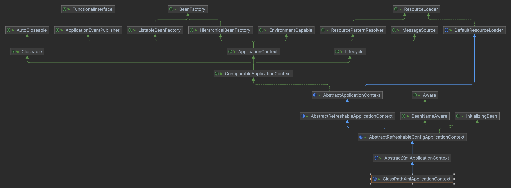

* AliasRegistry: 提供别名注册和管理的功能
* SingletonBeanRegistry: 提供单例注册和管理的功能
* BeanDefinitionRegistry: 提供BeanDefinition注册和管理的功能
* BeanFactory: 提供Bean实例的获取功能
* HierarchicalBeanFactory: 提供BeanFactory的层次结构功能
* ListableBeanFactory: 提供Bean实例列举检索的功能（能让你知道BeanFactory当前的容量）
* ConfigurableBeanFactory: 提供配置化的功能，比如设置类加载器、属性编辑器、BeanPostProcessor等
* AutowireCapableBeanFactory: 提供自动装配的功能
* ConfigurableListableBeanFactory: 提供配置化的ListableBeanFactory的功能

* ResourceLoader: 资源加载器，可以通过字符串形式的地址来获取相应的Resource对象，而无须关心这些资源底层怎么获取
* ApplicationEventPublisher: 应用事件发布器，可以用来发布事件，而无须关心事件如何到达监听器
* MessageSource: 用来支持国际化
* EnvironmentCapable: 可以获取Environment的接口
* BeanFactory: 继承了BeanFactory接口，是Spring容器的根接口
* ApplicationContext: 继承了MessageSource、ApplicationEventPublisher、EnvironmentCapable、ListableBeanFactory、HierarchicalBeanFactory、ResourceLoader、ApplicationEventPublisher接口，是Spring容器的高级接口
* Lifecycle: 生命周期接口，用来标识一个组件的生命周期
* ConfigurableApplicationContext: 继承了ApplicationContext接口，增加了对容器配置的支持，允许在容器刷新之前和之后对容器进行设置和修改
* AbstractApplicationContext: 抽象类，实现了ConfigurableApplicationContext接口，继承了DefaultResourceLoader类，实现了ConfigurableApplicationContext接口的部分方法，是ApplicationContext接口的抽象实现
* GenericApplicationContext: 继承了AbstractApplicationContext类，实现了BeanDefinitionRegistry接口，是一个完整的容器实现
* ClassPathXmlApplicationContext: 继承了AbstractXmlApplicationContext类，是从类路径下加载配置文件的容器实现
* AnnotationConfigApplicationContext: 继承了GenericApplicationContext类，是一个注解驱动的容器实现
* Aware: 一个空接口，实现该接口的Bean可以感知到所属的Spring容器
* BeanNameAware: 实现该接口的Bean可以感知到自己在容器中的ID
* BeanClassLoaderAware: 实现该接口的Bean可以感知到加载自己的类加载器
* BeanFactoryAware: 实现该接口的Bean可以感知到所属的BeanFactory
* EnvironmentAware: 实现该接口的Bean可以感知到所处的Environment
* MessageSourceAware: 实现该接口的Bean可以感知到所处的MessageSource
* ApplicationEventPublisherAware: 实现该接口的Bean可以感知到所处的ApplicationEventPublisher
* ResourceLoaderAware: 实现该接口的Bean可以感知到所处的ResourceLoader
* ApplicationContextAware: 实现该接口的Bean可以感知到所处的ApplicationContext
* BeanPostProcessor: Bean后置处理器，提供了在Bean初始化前后进行处理的能力
* BeanFactoryPostProcessor: BeanFactory后置处理器，提供了在BeanFactory标准初始化之后进行处理的能力
* BeanDefinitionRegistryPostProcessor: BeanDefinitionRegistry后置处理器，提供了在BeanDefinitionRegistry标准初始化之后进行处理的能力
* InstantiationAwareBeanPostProcessor: 实例化Bean后置处理器，提供了在Bean实例化之后进行处理的能力
* DestructionAwareBeanPostProcessor: 销毁Bean后置处理器，提供了在Bean销毁之前进行处理的能力